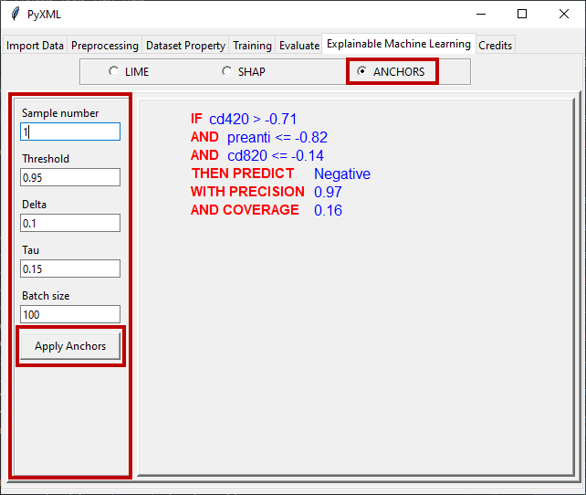

ANCHORS 
=======

ANCHORS is a high precision rule-based explanation method, presented by Ribeiro 
et al. [3]_. After activating the ANCHORS method via the radio button, ANCHORS 
hyperparameters such as sample number, threshold, delta, tau, and batch size can 
be set on the left side of the window. The ANCHORS method is adequately explained 
in the article for this software, but more information can be found in the original 
article.

Pressing the "Apply ANCHORS" button will apply ANCHORS to the machine learning 
method. The explanations of the ANCHORS method are shown in Figure 49. As can be 
seen in figure, the explanations are if-then rules, which are also referred to as 
anchors. In addition, prediction, precision, and coverage can also be displayed in 
the window.

.. _fig49:

   **Figure 49:** Explanations of ANCHORS

.. [3] Ribeiro, M. T., Singh, S., & Guestrin, C. (2018, April). Anchors: High-precision model-agnostic explanations. In Proceedings of the AAAI conference on artificial intelligence (Vol. 32, No. 1).