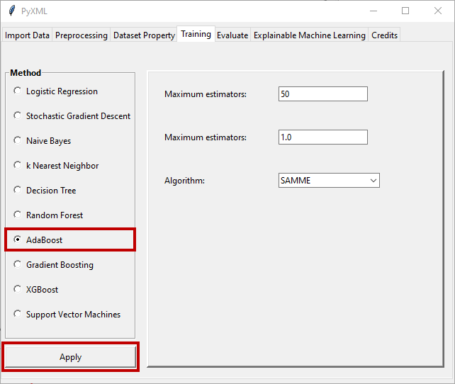

AdaBoost
========

Detailed information about hyperparameter determination for the AdaBoost 
method can be found on the Scikit-learn page. Scikit-learn's page for the 
AdaBoost method can be found at this `Link <https://scikit-learn.org/stable/modules/generated/sklearn.ensemble.AdaBoostClassifier.html>`_.
When the "AdaBoost" radio button is clicked, the window for the AdaBoost 
method becomes active and allows the hyperparameters of the method to be 
adjusted. Figure 37 shows the hyperparameter setting screen that is active 
upon selection of the AdaBoost method.

.. _fig37:

   **Figure 37:** Hyperparameter adjustment window of the AdaBoost method