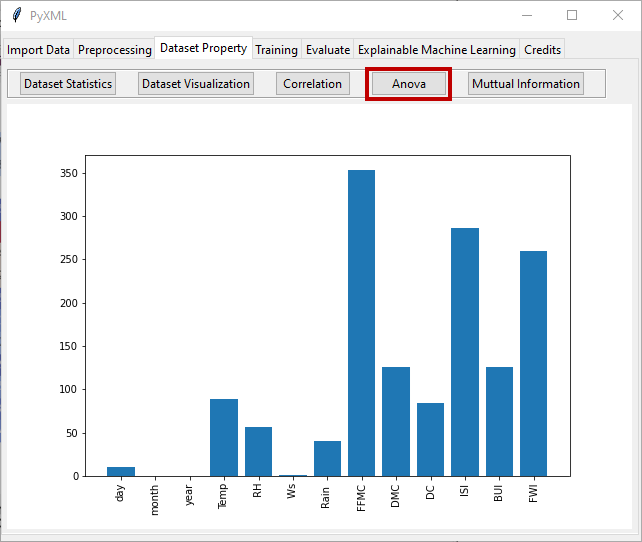

ANOVA
=====

Analysis of Variance (ANOVA), also known as F-test, is a statistical method 
utilized for analyzing differences between group means in a data set. ANOVA 
aids in determining the importance of each feature in explaining the variance 
of the target variable. F statistic is calculated by

.. math:: 
    \begin{array}{l}
    F\,statistic = \frac{{\frac{{SSB}}{{d{f_b}}}}}{{\frac{{SSW}}{{d{f_w}}}}}\,\\
    \,\,\,\,\,\,\,\,\,\,\,\,\,\,\,\,\,\,\,\,\,\,\,\,\,\,\,\,\, = \frac{{\frac{{SSB}}{{k - 1}}}}{{\frac{{SSW}}{{N - k}}}}\,\\
    where,\\
    \,\,\,\,\,\,\,\,\,\,\,\,\,SSB\, = \sum\limits_{i = 1}^k {{n_i}\left( {\overline {{X_i}}  - \overline X } \right)} \\
    \,\,\,\,\,\,\,\,\,\,\,\,SSW = \sum\limits_{i = 1}^k {\sum\limits_{j = 1}^{{n_i}} {\left( {{X_{ij}} - \overline {{X_i}} } \right)} } 
    \end{array}

* :math:`SSB\,=` Sum of Squares Between the groups
* :math:`{d{f_b}}\,=` Degrees of freedom between the groups
* :math:`SSW\,=` Sum of Squares Within the groups
* :math:`{d{f_w}}\,=` Degrees of Freedom Within the groups
* :math:`k` is the number of groups
* :math:`{n_i}` is the number of observations in the :math:`{i^{th}}` group
* :math:`\overline {{X_i}}` is the number of observations in the :math:`{i^{th}}` group
* :math:`\overline X` is the overall mean of the items
* :math:`{X_{ij}}` is the :math:`{j^{th}}` observation in the :math:`{i^{th}}` group
* :math:`N` is the total number of observations

By clicking on "ANOVA", the F-test is applied to the loaded data set. The 
feature importance of each feature is then illustrated by a bar graph in 
Figure 27.

.. _fig27:

   **Figure 27:** Feature importance with ANOVA
