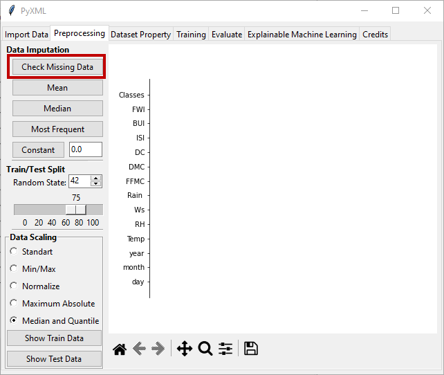
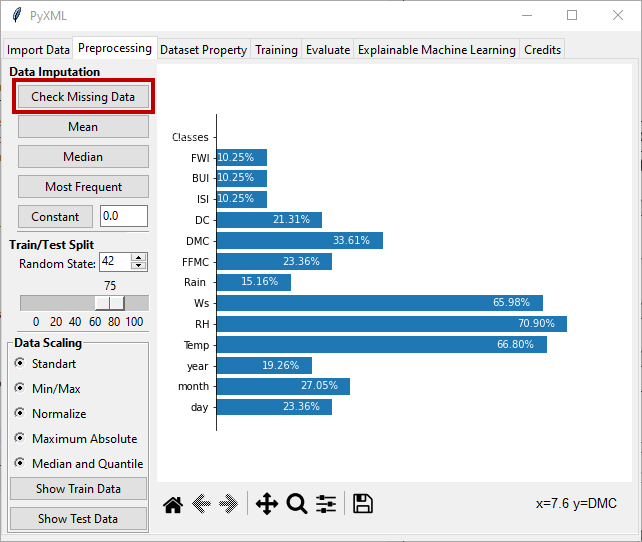

Check Missing Data
==================

The "Check Missing Data" button displays the percentage of missing data in 
each feature and the result is visualized as a horizontal bar chart as shown 
in Figure 5. If the loaded data set does not contain any missing values, the 
empty bar chart is shown with the y-axis corresponding to the feature names. 
The bar chart for the data set without missing data is presented in Figure 5.

.. _fig5:

   **Figure 5:** Data set without missing data

If the dataset contains missing data, the bar lengths of features with missing 
data are calculated and visualized based on the percentage of missing data. The 
length of the bar corresponds to the percentage of missing data in each feature. 
To demonstrate this function, some data in the Algerian_forest_fires dataset has 
been intentionally randomly deleted. Figure 6 shows the result for the dataset 
with missing data.

.. _fig6:

   **Figure 6:** Data set with missing data