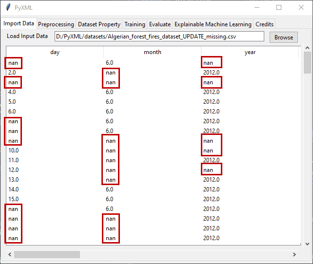

Constant Value
==============

In some cases, users may want to impute user-specified values to missing 
data according to the specific application. In this case, the value entered 
in the input widget next to the "Constant" button must be set to the value 
specified by the user.  Figure 13 shows the dataset with missing values. 

.. _fig13:

   **Figure 13:** Data with missing data

After clicking on the "Constant" button, the 
missing data in the dataset will be imputed with the value entered in the 
entry widget. The results of filling in missing features using the 
constant imputation method are shown in Figure 14. The default value for constant 
imputation is 0.0.

.. _fig14:

.. figure:: images/figure_14.png
   :alt: Result of median imputation method
   :align: center

   **Figure 14:** Result of median imputation method