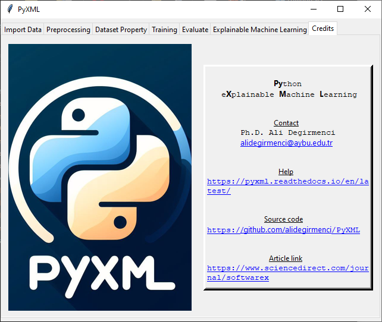

Credits 
=======

The "Credits" tab displays the logo and provides information about the 
software. Figure 50. shows the "Credits" tab.  The logo of the software 
is shown on the left side of the window. On the right side of the window

* Name of the software
* Contact: Author's contact details for further assistance.
* Help: Link to the user guide to use the software and explore its functionality
* Source Code: Link to the source code of this software
* Article Link: Link to the article to learn more about the software

.. _fig50:

   **Figure 50:** Credits tab of the PyXML
