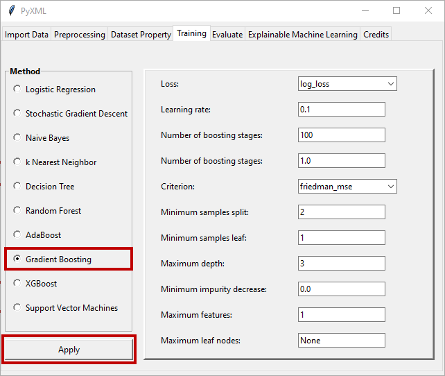

Gradient Boosting
=================

Detailed information about hyperparameter determination for the gradient 
boosting method can be found on the Scikit-learn page. Scikit-learn's page 
for the gradient boosting method can be found at this `Link <https://scikit-learn.org/stable/modules/generated/sklearn.ensemble.GradientBoostingClassifier.html>`_.
When the "Gradient Boosting" radio button is clicked, the window for the 
gradient boosting method becomes active and allows the hyperparameters of 
the method to be adjusted. Figure 38 shows the hyperparameter setting screen 
that is active upon selection of the gradient boosting method.

.. _fig38:

   **Figure 38:** Hyperparameter adjustment window of the gradient boosting method