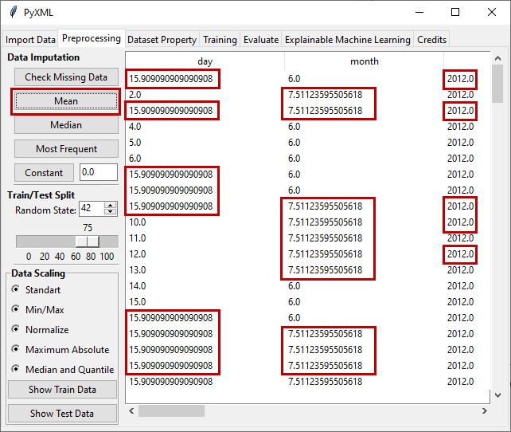

Mean Imputation
===============

In the Mean Imputation method, the average values of the features with 
missing data are computed and the missing data are filled with these values 
calculated for each feature. Figure 7 shows the dataset 
with missing values. 

.. _fig7:

.. figure:: images/figure_7.png
   :alt: Data with missing data
   :align: center

   **Figure 7:** Data with missing data

After clicking on the "Mean" button, missing values are imputed by mean 
imputation method. The results of filling in missing features using the 
mean imputation method are shown in Figure 8. 

.. _fig8:

   **Figure 8:** Result of mean imputation method