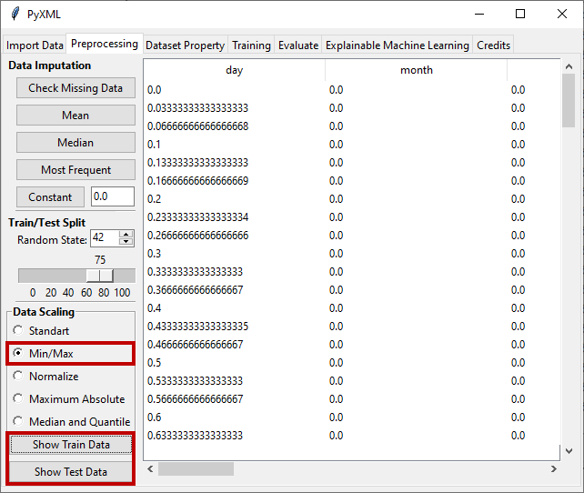

Min/Max Scaling
===============

In min/max scaling, feature values are scaled to the new range according to 
the minimum and maximum values of the processed feature. In this type of 
scaling, the minimum value of the feature is equal to 0, the maximum value 
is equal to 1, and the values between the minimum and maximum are scaled 
proportionally according to the value of the feature. Min/Max scaling 
defined as

.. math:: 
    {x_{\min \_\max \_scaled}} = \frac{{x - {x_{\min }}}}{{{x_{\max }} - {x_{\min }}}}

* :math:`x` is the feature value
* :math:`{x_{\min }}` is the minimum value of the feature 
* :math:`{x_{\max }}` is the maximum value of the feature 

The result of applying the min/max scaling method to the uploaded dataset is 
shown in Figure 18. Min/max scaled train and test sets can be viewed by 
clicking "Show Training Data" to view the train data and "Show Test Data" 
to view the test data.

.. _fig18:

   **Figure 18:** Application of min/max scaling