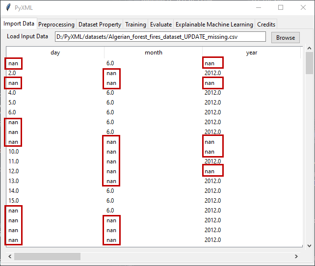
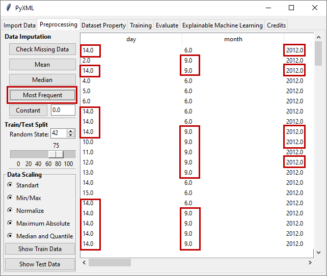

Most Frequent
=============

In the most frequent Imputation method, the most frequent values of the 
features with missing data are computed and the missing data are filled 
with these values computed for each feature. Figure 11 shows the dataset 
with missing values. 

.. _fig11:

   **Figure 11:** Data with missing data

After clicking on the "Most Frequent" button, missing values are imputed 
by most frequent imputation method. The results of filling in 
missing features using the most frequent imputation method are shown in 
Figure 12. 

.. _fig12:

   **Figure 12:** Result of most frequent imputation method