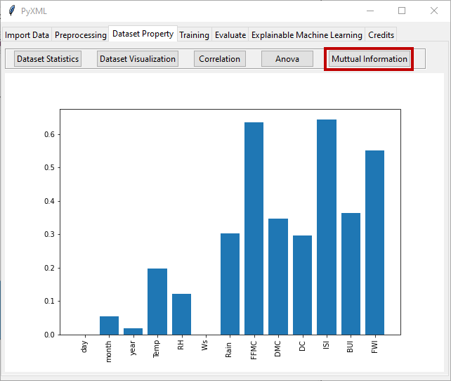

Mutual Information
==================

Mutual Information (MI) is a statistical measure that quantifies the mutual 
dependence between the two variables. The range of mutual information values 
is from 0 to positive infinity. There is no interdependence between variables 
when the value of MI is equal to 0, which means that knowing the value of one 
variable does not provide any information about the other variable. When the 
value of MI increases, the mutual dependence between variables becomes 
stronger. In machine learning, this method is often used to evaluate the 
relationship between features and the target variable. It aids in determining 
which features are most informative or predictive about the output.  The MI is 
given by

.. math:: 
    MI\left( {X,Y} \right) = \sum\limits_{x \in X} {\sum\limits_{y \in Y} {p\left( {x,y} \right)\log \left( {\frac{{p\left( {x,y} \right)}}{{p\left( x \right)p\left( y \right)}}} \right)} }

* :math:`{p\left( {x,y} \right)}` is the joint probability distribution function of :math:`X`  and :math:`Y`
* :math:`{p\left( x \right)}` is are the marginal probability distribution functions for :math:`X` 
* :math:`{p\left( y \right)}` is are the marginal probability distribution functions for :math:`Y`

 By clicking on "Mutual Information", the Mutual Information method is applied 
 to the loaded data set. The feature importance of each feature is then 
 illustrated by a bar graph in Figure 28.

.. _fig28:

   **Figure 28:** Feature importance with Mutual Information