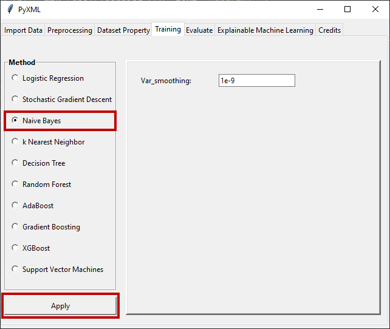

Naive Bayes
===========

Detailed information about hyperparameter determination for the Naive Bayes 
method can be found on the Scikit-learn page. Scikit-learn's page for the 
Naive Bayes method can be found at this `Link <https://scikit-learn.org/stable/modules/generated/sklearn.naive_bayes.GaussianNB.html#sklearn.naive_bayes.GaussianNB>`_.
When the "Naive Bayes" radio button is clicked, the window for the Naive 
Bayes method becomes active and allows the hyperparameters of the method 
to be adjusted. Figure 33 shows the hyperparameter setting screen that is 
active upon selection of the Naive Bayes method.

.. _fig33:

   **Figure 33:** Hyperparameter adjustment window of the Naive Bayes method