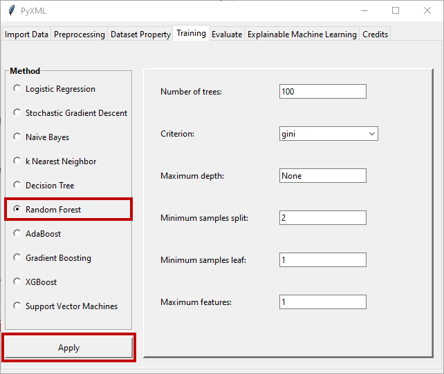

Random Forest
=============

Detailed information about hyperparameter determination for the random 
forest method can be found on the Scikit-learn page. Scikit-learn's page 
for the random forest method can be found at this `Link <https://scikit-learn.org/stable/modules/generated/sklearn.ensemble.RandomForestClassifier.html>`_.
When the "Random Forest" radio button is clicked, the window for the 
random forest method becomes active and allows the hyperparameters of the 
method to be adjusted. Figure 36 shows the hyperparameter setting screen 
that is active upon selection of the random forest method.

.. _fig36:

   **Figure 36:** Hyperparameter adjustment window of the random forest method