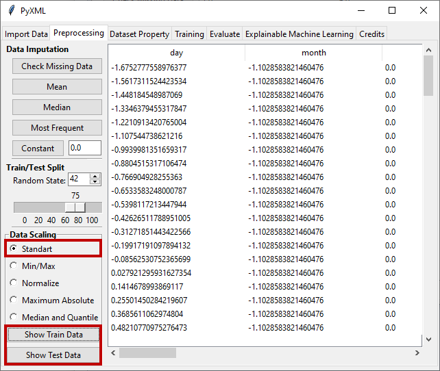

Standard Scaling
================

A standard scaler standardizes features by subtracting the mean and 
scaling to unit variance.  After applying standard scaling to the data, 
the features have a mean of zero and a standard deviation of 1. It 
assumes that the distribution of the data is Gaussian. Standard scaling 
defined as

.. math:: 
    {x_{standard\_scaled}} = \frac{{x - \mu }}{\sigma }

* :math:`x` is the feature value
* :math:`\mu` is the mean of the feature 
* :math:`\sigma` is the standard deviation of the feature

The result of applying the standard scaling method to the uploaded dataset 
is shown in Figure 17. Standard scaled train and test sets can be viewed 
by clicking "Show Training Data" to view the train data and "Show Test Data" 
to view the test data.

.. _fig17:

   **Figure 17:** Application of standard scaling