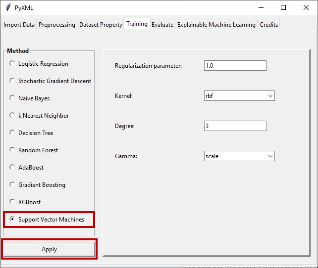

Support Vector Machines
=======================

Detailed information about hyperparameter determination for the support 
vector machines method can be found on the Scikit-learn page. Scikit-learn's 
page for the support vector machines method can be found at this `Link <https://scikit-learn.org/stable/modules/generated/sklearn.svm.SVC.html>`_. 
When the "Support Vector Machines" radio button is clicked, the window for 
the support vector machines method becomes active and allows the hyperparameters 
of the method to be adjusted. Figure 40 shows the hyperparameter setting screen 
that is active upon selection of the support vector machines method.

.. _fig40:

   **Figure 40:** Hyperparameter adjustment window of the support vector machines method