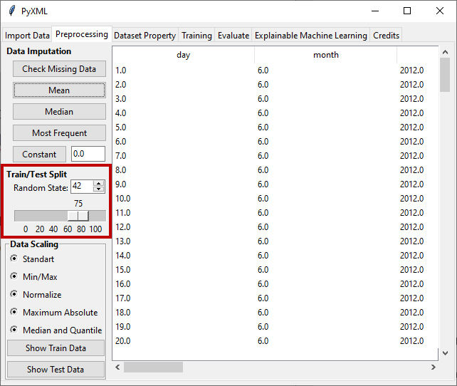

Train/Test Split 
================

The dataset needs to be divided into training and test sets to measure the 
performance of machine learning algorithms.  In this section of the 
"Preprocessing" tab, the ratio of the training and test sets is determined by 
means of a graphical slider and the percentage of this split is shown above 
the slider. In addition, the random state parameter used to control the 
randomness of the data splitting process is obtained from the user via the 
entry widget. In the GUI, users have the capability to set the random state 
within the range of :math:`[-1, 2^{32} - 1]`. When the random state is set to 
-1, it corresponds to "random_state=None" in the script, resulting in a 
different split of the training/testing sets with each execution. Conversely, 
setting the random state to any value other than -1 seeds the random state 
with the specified value, as shown in Figure 15. After applying one of the 
data scaling methods, the train and test sets can be viewed by clicking 
"Show Training Data" to view the train data and "Show Test Data" to view the 
test data.

.. _fig15:

   **Figure 15:** Splitting the dataset into train and test sets

