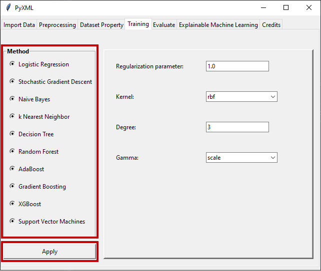
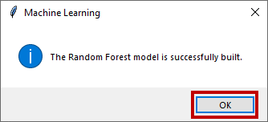

Training
========

The Mahine learning model is created in the "Training" tab based on the scaled 
training set constructed in the "Preprocessing" tab. It allows the application 
of 10 different machine learning models which are logistic regression, 
stochastic gradient descent, Naive Bayes, k nearest neighbors, decision tree, 
random forest, AdaBoost, gradient boosting, XBGoost, and support vector machines.
Users must first select the machine learning model they want to apply via radio 
buttons. Then, the windows where the hyperparameters specific to the selected 
method can be set will be active in the user interface. Subsequently, the 
method-specific hyperparameters can be set by the user. The hyperparameters 
defined by default in Scikit-learn are set for each method. After the machine 
learning method is determined and the hyperparameters are adjusted, the machine 
learning model is created by using the "Apply" button, as shown in Figure 29. 

.. _fig29:

   **Figure 29:** Machine learning method selection and hyperparameter optimization

A messagebox window is displayed to indicate the end of the process, as shown 
in Figure 30. Users can find out the performance of the model created by 
clicking on the "Evaluate" tab after clicking on the OK button in the message 
box.

.. _fig30:

   **Figure 30:** Message box indicating the successful creation of the selected machine learning model

.. toctree::
   :maxdepth: 2
   :hidden:
   :caption: Training

   Logistic Regression <logistic_regression>
   Stochastic Gradient Descent <stochastic_gradient_descent>
   Naive Bayes <naive_bayes>
   k Nearest Neighbors <k_nearest_neighbors>
   Decision Tree <decision_tree>
   Random Forest <random_forest>
   AdaBoost <adaboost>
   Gradient Boosting <gradient_boosting>
   XGBoost <xgboost>
   Support Vector Machines <support_vector_machines>
